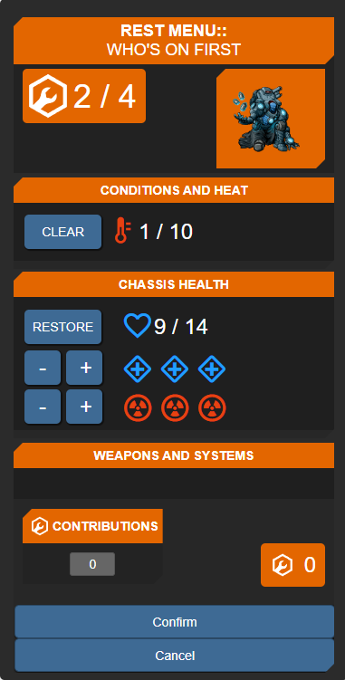
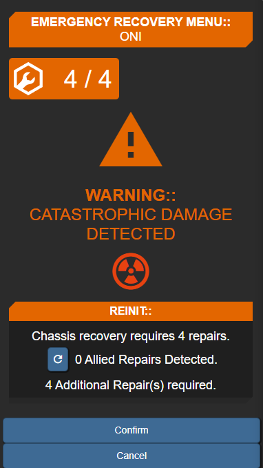

# Carcosas-Lancer-Macros
A collection of useful macros I've written for the Lancer system on Foundry.

Currently, these macros are verified to work with Foundry V10.291, Lancer version 1.6.1 except where stated otherwise. 

Most of my macros are not yet updated to work for V11; I will work on them In Due Time. I will mark which ones are V11 compatiable.

This is _not_ a Foundry module! To add each macro to your game, simply create a new macro in your foundry world, set it to a script macro, and copy paste the macro in. Detailed information is included in the file for each macro, including any other module prerequisites; Please read carefully.

Basic description of the currently available macros:

## [Apply Damage Macro](applydamage_base_v5_FoundryV11.js)
Requires:  Math.js

A macro that offers a quick little pop-up menu to apply damage to tokens. Select a token, run the macro, input the damage, and the macro will apply the damage correctly to the token. The macro automatically considers armor & overshield, and there are three extra settings that let you set if the damage should be resisted, if the damage is armor-piercing, or if the target is exposed. Supports heat/burn as well.

V11 Update: AnatoleSerial has very kindly updated this macro to V11; it has been uploaded as `applydamage_base_v5_FoundryV11.js`. Additionally, they have stripped out the (defunct) Warpgate dependency! 

V10 version moved to `archive` folder. Macro versions 3.2 and older require Warpgate to function.

## [Auto Apply Damage Macro](applydamage_auto_v1_3_FoundryV11.js)
Requires: Warpgate, Math.js, Advanced Macros

A companion macro to the Apply Damage macro; this macro scans the chat for the _most recent_ weapon damage roll and then runs the Apply Damage macro, prefills damage field with the discovered damage and hiding non-applicable damage buttons. You still need to manually set resistance or armor piercing and choose the damage type. Automatically doubles damage for targets that have the Exposed condition.

_Only_ detects weapon damage rolls; invades/grenades/etc don't roll damage and therefore aren't detected.

This _requires_ the Apply Damage macro to exist in the same Foundry world, and requires that it be named "Apply Damage" exactly. 

V11 Update: Zenn has updated this macro to V11; it has been uploaded as `applydamage_auto_V1_3_FoundryV11.js`. This version should be used alongside `applydamage_base_v3_4` (or higher).

V10 version moved to `archive` folder.

## [Political Map Overlay Converter](polmap_converter_script_v1_6.js)
Requires: Political Map Overlay, Math.js

A macro that allows you to quickly create drawings in foundry to denote zones/cover/etc. Use the Political Map Overlay module to actually color the zones, then use this macro to quickly convert them into Foundry drawings. Can also convert Political Map Overlay zones into walls & difficult terrain (from Monk's Enhanced Terrain layer module). Highly customizable.

V11 Update: Tentatively seems to work on V11 with no changes necessary. Make sure you update your Political Map Overlay module to the V11 compatiable version, but this macro should not require updates. Please let me know if errors are encountered.

## [Quick Combat Builder](lancer_quick_combat_builder_v1_3_FoundryV11.js)
Requires: Advanced Macros, Math.js

A script that takes a text description of an encounter composition as input, and creates all the NPCs for you, complete with class/templates/optionals. Will also auto-assign art if you have the tokens uploaded. All NPCs are created into a folder of your choice. See header of macro for details on usage/formatting.

V11 Update: Compatiable with V11, no major changes. use lancer_quick_combat_builder_v1_3_FoundryV11.js. 

V10 version moved to `archive` folder.

## [Deploy Item](deploy_item_v2_FoundryV11.js)
Displays the selected token's owned deployables in a selectable list.  After selecting a deployable, Left-click to place the token on the previewed space. Right-click or hit Escape to cancel placement.

## [Eye of Horus](lancer_eye_of_horus_v1.js)
Whispers targeted token(s) HP, Heat, E-Defense and Evasion stats to selected Player Character's.
(Also works great for Lotus Projector)

## [Rest Menu](lancer_rest_v1.js)
Adds a comprehensive rest menu to take players through the post-combat rest process with a selectable ledger of options and live updating costs that respect the player's available repairs.
Includes heat and conditon* clearing, HP, Structure, Stress, destroyed weapons and systems and  allied mech repair contributions on the base form.
Also allows players to contribute additional repairs toward destroyed allied mechs.
On Confirm, the macro performs the selected functions, deducts repairs and sends a report to chat.

*The Condition button will only appear if an actor has a condition present.

For Destroyed mechs (Detected when either structure or Stress are 0) an alternate form prompts the user for 4 repairs to recover their mech.
This form checks the last 5 messages from chat to find repair contributions, and deducts any it finds from the final cost.
On confirm, Structure and Stress are set to 1, HP to Max, and the normal Rest form appears.

## Troubleshooting
I maintain a thread on the PILOT.NET discord server, which you can access [here](https://discord.com/channels/426286410496999425/1092876995341328445); if you need help getting these macros to work or you think you've found a bug or something, you can contact me there (ideally with your Foundry version, Lancer version, a description of your workflow, and screenshots of errors, if any).

Before doing so, however, please run through the generic self-troubleshooting steps:
1. Make sure you're using the most recent macro version
2. Make sure the macro is actually correctly installed & is set to script (as opposed to chat)
3. Double check all prerequisites are installed.
